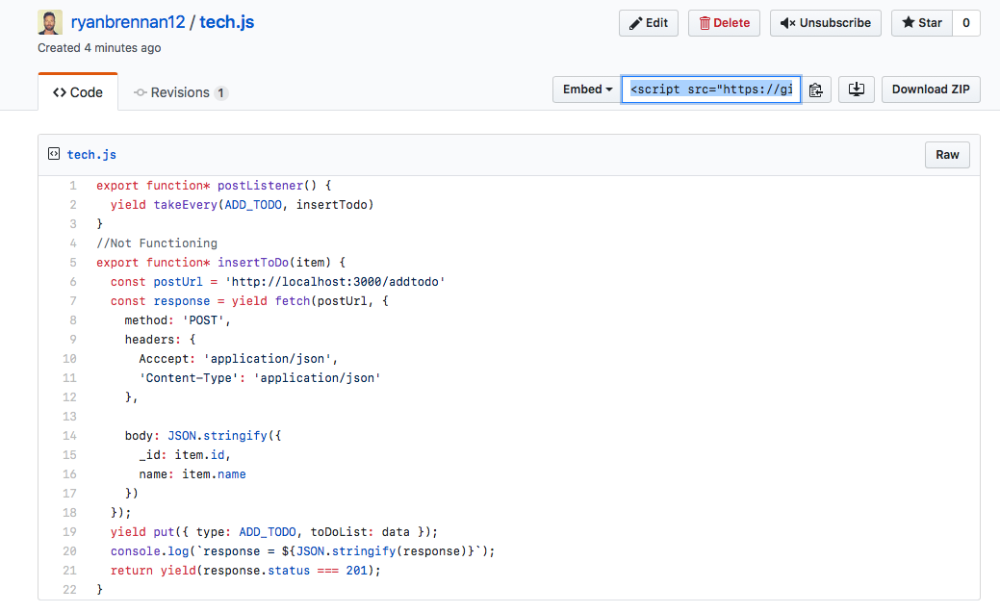

# 1.  Tech Screen TOC

 - [1.2. To do](#12-to-do)
 - [1.3. Usage](#13-usage)
  - [1.3.1. Development Setup](#131-development-setup)
  - [1.3.2. API endpoints](#132-api-endpoints)
 - [1.4. Log](#14-log)


## 1.2. To do
 ```
 Server:

  [x] Utilize a Node / Express server
  [x] contain an array of strings
  [x] Have one endpoint to fetch all strings
  [x] Have one endpoint to prepend a new string to the array

 Client:

  [x] Have one page to display all strings stored on server.
  [x] Have one page with UI to input a string and send to server.
  [x] Allow a user to navigate between the two pages.
  [x] Not be fully styled, but should be laid out in a meaningful way.

  To include:
  [x] React Router
  [x] Redux
  [x] Redux Saga
  [ ]Reselect
  [x-] Styled Components - Use at least one styled component. The component must have a prop passed into the - Styled Component for conditional rendering.
  [x-] Unit Tests for one container
```

## 1.3. Usage

DMI App is is a basic ToDo with two endpoints; one to view the list stored on the server.  And another endpoint to add a ToDo to the list.  Delete coming soon...stay tuned

**MVP UI**


## 1.3.1 Development Setup

```sh
# install npm dependencies
$> cd /dmiapp
$> npm install

# start application
$> npm start
# Now enjoy;-)
```

###  1.3.2 API Endpoints

+ GET `/onmount`
  - in place of of an AJAX call inside of ComponentDidMount, this GET request is
  called by the `fetchToDoList` saga by the `loadTodoList` saga which is listening for
  `RENDER_TODO_LIST` actions .
  - the data is fethed from the express server and rendered as a list

+ POST `/addtodo`
  - placed in the `AddToDo`- updates server.  see [1.4. Log](#14-log) for details why this
  was not in the saga


## 1.4. Log
  - As outlined in the development setup, we are using React BoilerPlate (link here)
  - Run `npm run clean` to delete the example app.

  - Start in `containers/App/HomePage/index.js`
  - Staying true the [container/component architecture](https://medium.com/@dan_abramov/smart-and-dumb-components-7ca2f9a7c7d0#.4rmjqneiw), I created `reducer.js` files within each container folder

  - entry point `app/app.js`
  - `containers/App/index.js` is where we are exporting app
  - installed Bootstrap for familiarity with fast styling

  - Ran into issues getting today simply getting the `GET` request to fire on the express server.  Initially thouhgt it was a React Router problem as it was blanketing all the available endpoints making requests to the server blocked.
  Turned out to be an express issue, especially my unfamiliarity with the boilerplate's structure, ie the middleware folder.  This is where our staic file was being served.

  -Did not end up hitting MVP (Reselect, unfinished test suite) because I allocated too much time to getting this non-functioning saga to handle the `POST` request


https://gist.github.com/ryanbrennan12/18ea111bfa87211d168f4b809dd4e3bd

  - biggest challenge turned out to be navigating the boilerplate.  I would have asked for more clarifying questions in a production setting, as to what pieces of the boilerplate I could take entirely out and things of that nature.

  -Starting this app completely from scratch using the same unfamiliar libraries and functionality could have been accomplished in a fraction of the time.  As much as I explored the boilerplate before I began, the lesson learned here that a bit more time investigating it  would have been the ticket.

  -Great exercise all together though. Im really excited about digging into Reselect and Sagas that much more and finishing this app.


