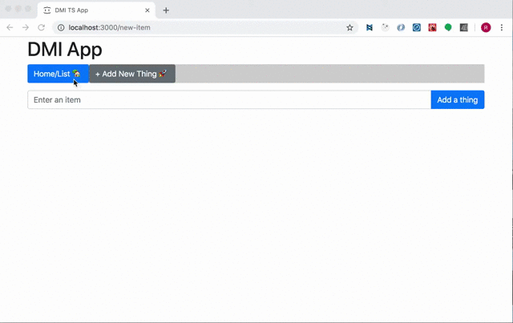

# 1.  Tech Screen TOC

 - [1.2. To do](#12-to-do)
 - [1.3. Usage](#13-usage)
  - [1.3.1. API endpoints](#131-api-endpoints)
 - [1.4. Log](#14-log)


## 1.2. To do
 ```
 Server:

  - Utilize a Node / Express server
  - contain an array of strings
  - Have one endpoint to fetch all strings
  - Have one endpoint to prepend a new string to the array

 Client:

  - Have one page to display all strings stored on server.
  - Have one page with UI to input a string and send to server.
  - Allow a user to navigate between the two pages.
  - Not be fully styled, but should be laid out in a meaningful way.

  To include:
  - React Router
  - Redux
  - Redux Saga
  - Reselect
  - Styled Components - Use at least one styled component. The component must have a prop passed into the - Styled Component for conditional rendering.
  - Unit Tests for one container
```

## 1.3. Usage

DMI App is is a basic ToDo with two endpoints; one to view the list stored on the server.  And another endpoint to add a ToDo to the list.  Delete coming soon...stay tuned

**MVP UI**



###  1.3.1 API Endpoints

+ GET `/onmount`
  - in place of of an AJAX call inside of ComponentDidMount, this GET request is
  called by the `fetchToDoList` saga by the `loadTodoList` saga which is listening for
  `RENDER_TODO_LIST` actions .
  - the data is fethed from the express server and rendered as a list

+ POST `/addtodo`
  - placed in the `AddToDo`- updates server.  see [1.4. Log](#14-log) for details why this
  was not in the saga


## 1.4. Log
  - As outlined in the development setup, we are using React BoilerPlate (link here)
  - Run `npm run clean` to delete the example app.

  - Start in `containers/App/HomePage/index.js`
  - Staying true the [container/component architecture](https://medium.com/@dan_abramov/smart-and-dumb-components-7ca2f9a7c7d0#.4rmjqneiw), I created `reducer.js` files within each container folder

  - entry point `app/app.js`
  - `containers/App/index.js` is where we are exporting app
  - installed Bootstrap for familiarity with fast styling

  -

  <script src=https://gist.github.com/ryanbrennan12/18ea111bfa87211d168f4b809dd4e3bd></script>


